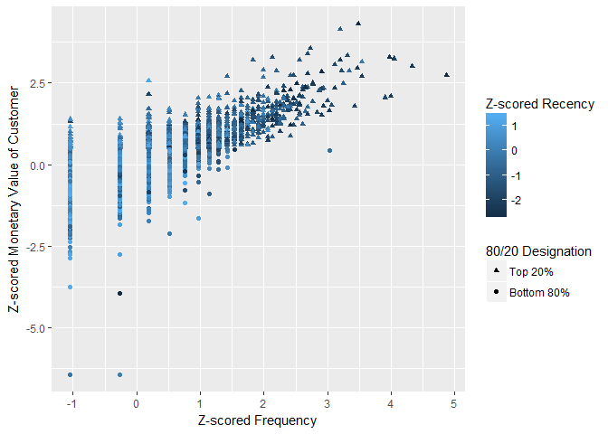
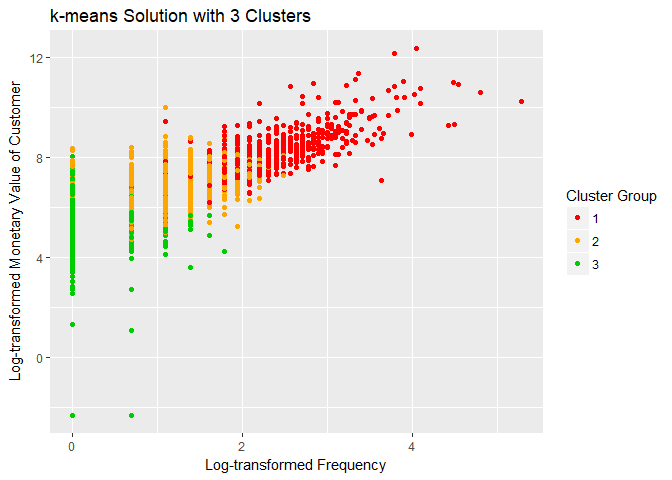

---
title: "Segmentation Using K Means"
output: html_notebook
---


Data Source: [archive.ics.uci.edu/](https://archive.ics.uci.edu/ml/datasets/Online+Retail)

Customer Segmentation is a subject of intense analysis in the corridors of Business Planning. There are many ways in which Anlaysts approach segmenting customers; however, the basis lies in the Business Problem at hand.

Dataset -- In this particluar case, I have borrowed data from UCI archive by Prof Draquin Chen as published in Journal of Database Marketing and Customer Strategy Management. 

Approach -- THe data is cleaned,preprocessed and subject to K-means clustering.

Caveat -- It is assumed that customers of the dataset are indeed different from each other. Practiaclly, such cases are rare. 


### Import Data


### Cleaning Data
Missing Data removal: ID numbers are unavailable for a number of data rows. Remove any observations with missing ID numbers. Analysis would be conducted at customer level. 


```
## [1] 4373
```

```
## [1] 135080
```

### Tidying Data
Limiting date range to one full year.


```
## [1] "2010-12-01 08:26:00 UTC" "2011-12-09 12:50:00 UTC"
```

```
## [1] "2010-12-09 08:34:00 UTC" "2011-12-09 12:50:00 UTC"
```

### Adding Geographic Constraints
Using on United Kingdom's data share


```
## 
##            Australia              Austria              Bahrain 
##                 1237                  401                   17 
##              Belgium               Brazil               Canada 
##                 2057                   32                  151 
##      Channel Islands               Cyprus       Czech Republic 
##                  758                  622                   30 
##              Denmark                 EIRE   European Community 
##                  389                 7351                   61 
##              Finland               France              Germany 
##                  695                 8313                 9274 
##               Greece              Iceland               Israel 
##                  146                  151                  250 
##                Italy                Japan              Lebanon 
##                  778                  342                   45 
##                Malta          Netherlands               Norway 
##                  127                 2369                  939 
##               Poland             Portugal                  RSA 
##                  333                 1413                   58 
##         Saudi Arabia            Singapore                Spain 
##                   10                  229                 2528 
##               Sweden          Switzerland United Arab Emirates 
##                  462                 1871                   68 
##       United Kingdom          Unspecified                  USA 
##               349806                  244                  291
```


### Complete Dataset


```
## [1] 19140
```


We now have a dataset of 19,140 unique invoices and 3,891 unique customers.


### Identify returns
Invoice purchases are different from Invoice of Returns. Adjust accordingly.


## RFM Variables
Create Customer level Dataset


Create Recency Dataset


Create Frequency Dataset


```
## [1]   0 196
```

```
## 
##    0    1    2    3    4    5    6    7    8    9   10   11   12   13   14 
##   28 1357  722  466  348  218  157  112   85   62   43   56   30   26   23 
##   15   16   17   18   19   20   21   22   23   24   25   26   27   28   29 
##   18   12   15   14   10   10    5    7    6    4    9    4    3    5    1 
##   30   32   33   34   35   37   38   39   41   44   45   46   49   50   54 
##    3    1    2    3    2    1    2    1    2    3    1    1    1    1    1 
##   56   57   60   83   88   90   94  121  196 
##    1    1    2    1    1    1    1    1    1
```


Create Monetary Value Dataset

<!-- --><!-- -->

## Pareto Principle

80/20 Rule

In this context, it implies that ~80% of sales would be produced by the top ~20% of customers. These 20% represent the high-value, important customers a business would want to protect.

To make a point about outliers below, I create some simple segments here by looking at the top customers who produced 80% of annual sales for the year. In this dataset, 80% of the annual sales are produced by the top 29% of customers, so the percentage isn't quite 20%, but it's not that far off and it does illustrate that there's a smallish segment producing the bulk of the value.


```
## [1] "Top 20%"    "Bottom 80%"
```

```
## 
##    Top 20% Bottom 80% 
##       0.29       0.71
```


## Preprocess data 

k-means clustering requires continuous variables and works best with relatively normally-distributed, standardized input variables. Standardizing the input variables is quite important; otherwise, input variables with larger variances will have commensurately greater influence on the results. Below, I transform our three input variables to reduce positive skew and then standardize them as z-scores.


Visualize data 

<!-- -->


This first graph uses the variables' original metrics and is almost completely uninterpretable.  There's a clump of data points in the lower left-hand corner of the plot, and then a few outliers. This is why we log-transformed the input variables.


<!-- -->

Now we can see a scattering of high-value, high-frequency customers in the top, right-hand corner of the graph. These data points are dark, indicating that they've purchased something recently. In the bottom, left-hand corner of the plot, we can see a couple of low-value, low frequency customers who haven't purchased anything recently, with a range of values in between.


### Handling outliers

One question we might have about those dots in the bottom, left-hand corner is how many customers they represent. The following code investigates them a little more thoroughly.


The no-value customers are all customers who returned everything they bought. k-means clustering is sensitive to outliers. Often, outliers will huddle up clustered together in a seld contained grroup. For our experiment, these outliers are deliberately included.


<!-- -->


## Determine number of clusters / run k-means


```
## [1] 1
```

<!-- -->

```
## [1] "k-means Solution with 1 Clusters"
##   Cluster monetary frequency recency
## 1       1   626.99         2      50
## 
## 
## [1] 2
```

<!-- -->

```
## [1] "k-means Solution with 2 Clusters"
##   Cluster monetary frequency recency
## 1       1  1797.78         5      17
## 2       2   327.50         1      96
## 
## 
## [1] 3
```

<!-- -->

```
## [1] "k-means Solution with 3 Clusters"
##   Cluster monetary frequency recency
## 1       1  3213.34         9       8
## 2       2   921.10         3      34
## 3       3   259.44         1     144
## 
## 
## [1] 4
```

<!-- -->

```
## [1] "k-means Solution with 4 Clusters"
##   Cluster monetary frequency recency
## 1       1   258.76         1     178
## 2       2  1140.64         4      52
## 3       3   372.90         2      20
## 4       4  3152.82         9       8
## 
## 
## [1] 5
```

<!-- -->

```
## [1] "k-means Solution with 5 Clusters"
##   Cluster monetary frequency recency
## 1       1   282.45         1     177
## 2       2   357.20         2      20
## 3       3  3186.59         9       8
## 4       4     0.00         1     135
## 5       5  1170.85         4      48
## 
## 
## [1] 6
```

<!-- -->

```
## [1] "k-means Solution with 6 Clusters"
##   Cluster monetary frequency recency
## 1       1     0.00         1     110
## 2       2   301.91         1      37
## 3       3  4350.12        12       9
## 4       4  1083.14         4       9
## 5       5   258.88         1     215
## 6       6  1130.97         4      60
## 
## 
## [1] 7
```

<!-- -->

```
## [1] "k-means Solution with 7 Clusters"
##   Cluster monetary frequency recency
## 1       1  2129.96         6      30
## 2       2   834.99         3      10
## 3       3  4677.76        13       5
## 4       4   223.47         1     233
## 5       5   266.35         1      39
## 6       6     0.00         1     110
## 7       7   773.44         3      86
## 
## 
## [1] 8
```

<!-- -->

```
## [1] "k-means Solution with 8 Clusters"
##   Cluster monetary frequency recency
## 1       1  7170.25        18       5
## 2       2  1903.59         6       5
## 3       3   714.42         2      99
## 4       4   250.38         1      45
## 5       5   632.97         2      18
## 6       6   216.63         1     236
## 7       7  2083.42         6      34
## 8       8     0.00         1     110
## 
## 
## [1] 9
```

<!-- -->

```
## [1] "k-means Solution with 9 Clusters"
##   Cluster monetary frequency recency
## 1       1  1985.79         6       6
## 2       2   705.12         2     116
## 3       3  7454.07        18       5
## 4       4     0.00         1     135
## 5       5   815.02         3      26
## 6       6   267.13         1      48
## 7       7  2369.28         6      38
## 8       8   212.93         1     240
## 9       9   388.65         2       8
## 
## 
## [1] 10
```

<!-- -->

```
## [1] "k-means Solution with 10 Clusters"
##    Cluster monetary frequency recency
## 1        1  2015.01         6       6
## 2        2  2305.14         6      39
## 3        3   148.70         1     236
## 4        4   234.34         1      38
## 5        5   411.86         1     186
## 6        6   808.51         3      25
## 7        7   644.30         2     120
## 8        8   440.78         2       5
## 9        9     0.00         1     110
## 10      10  7454.07        18       5
```


A 2-cluster solution produces one group of high-value (median = $1,797.78), high-frequency (median = 5 purchases) customers who have purchased recently (median = 17 days since their most recent purchase), and one group of lower value (median = $327.50), low frequency (median = 1 purchase) customers for whom it's been a median of 96 days since their last purchase. Although these two clusters are clear and interpretable, this may be simplifying customer behavior too much.

The 5-cluster solution gives us: a high-value, high-frequency, recent purchase group (cluster 5), a medium-value, medium-frequency, relatively-recent purchase group (cluster 2), two clusters of low-value, low-frequency customers broken down by whether their last purchase was recent or much earlier in the year (clusters 3 and 1, respectively), and lastly a no-value cluster whose median value to the business is $0.00 (cluster 4).

As we move beyond 5 clusters, the graphs become increasingly hard to interpret visually, and the cluster centers start to make distinctions that may not be that helpful (e.g., low-value-with-1-purchase vs. low-value-with-2-purchases customers).


### Skree Plot 

<!-- --><!-- -->
Both graphs look to have elbows at around 2 clusters, but a 2-cluster solution explains only 49% of the variance and, once again, a 2-cluster solution may be too much of a simplification to really help the business with targeted marketing. The 5-cluster solution explains ~73% of the variance, but there are no clear elbows in the graph at this point.

###  NbClust Auto Recommendations and Optimizations

Lastly, we can use NbClust package that will look at multitude of different fit indices and, using majority rule, suggest the number of clusters that most indices recommend. 

For computational stress, the section is commented out.


The greatest number of indices recommend the 2-cluster solution. 


## Three-Dimensional Representation of Clusters


PS: 3 Cluster Model


